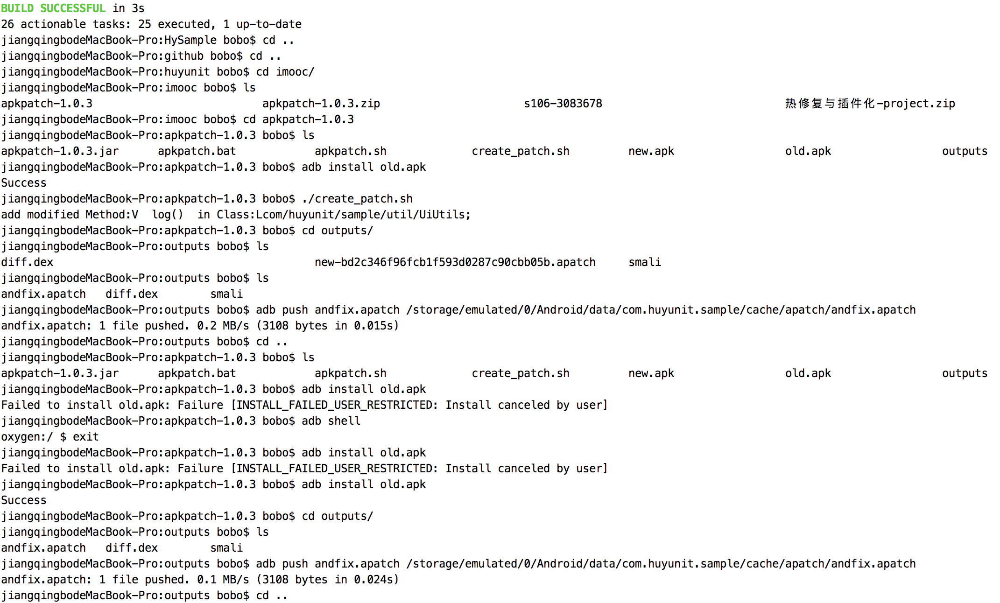
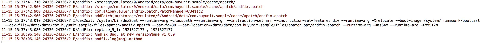
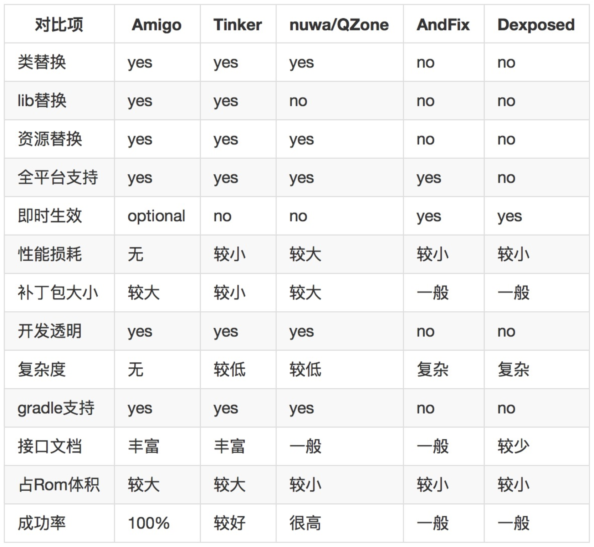

#集成Alibaba开源框架AndFix热修复功能

##按照 [AndFix官网](https://github.com/alibaba/AndFix) 步骤操作

#### 介绍下其他平台的框架

alibaba还出了一款开源框架：Sophix (商业版收费)，集成也是非常简单，成功率也很高，[简书文档介绍](http://www.jianshu.com/p/8ea4d653a53e)。

美团点评：Robust，成功率也很高，[热更新文档](https://tech.meituan.com/android_robust.html), [RobustDemo.Github](https://github.com/Meituan-Dianping/Robust)

饿了么： Amigo, [Github](https://github.com/eleme/Amigo), [CSDN解说文档](http://blog.csdn.net/yangxi_pekin/article/details/52523872)

QQ空间（QZone）：Nuwa

RocooFix：Nuwa改进版

Dexposed：不考虑，需要root权限

微信(apk补丁)：Tinker, [Github](https://github.com/Tencent/tinker)

### 1、集成andfix开源包  

    //引入AndFix热修复模块
    compile 'com.alipay.euler:andfix:0.5.0@aar'
    
### 2、编写AndFixPatchManager单例类

    详细请看源码 andfix/AndFixPatchManager.java    
    
### 3、在Application类的onCreate方法初始化

    详细请看源码 App.java
    
### 4、编写代码，制作bug方法

    源码 andfix/TestAndFixFragment.java

### 5、生成带bug的apk包，记住一定要带有签名的包，之后安装到手机中

    在AS工具的Terminal控制台中输入：./gradlew assembleRelease
    
### 6、修改并分析代码后，将Bug修复掉，并测试，在打包新的apk包

    同样执行指令：./gradlew assembleRelease
    
### 7、下载apkpatch-1.0.3插件，在AndFix官网有下载链接

    里面自带3个文件：apkpatch-1.0.3.jar  apkpatch.bat  apkpatch.sh
    
### 8、指令生成 .patch 文件

    jiangqingbodeMacBook-Pro:apkpatch-1.0.3 bobo$ ./apkpatch.sh
    ApkPatch v1.0.3 - a tool for build/merge Android Patch file (.apatch).
    Copyright 2015 supern lee <sanping.li@alipay.com>
    
    usage: apkpatch -f <new> -t <old> -o <output> -k <keystore> -p <***> -a <alias> -e <***>
     -a,--alias <alias>     alias.
     -e,--epassword <***>   entry password.
     -f,--from <loc>        new Apk file path.
     -k,--keystore <loc>    keystore path.
     -n,--name <name>       patch name.
     -o,--out <dir>         output dir.
     -p,--kpassword <***>   keystore password.
     -t,--to <loc>          old Apk file path.
    
    usage: apkpatch -m <apatch_path...> -k <keystore> -p <***> -a <alias> -e <***>
     -a,--alias <alias>     alias.
     -e,--epassword <***>   entry password.
     -k,--keystore <loc>    keystore path.
     -m,--merge <loc...>    path of .apatch files.
     -n,--name <name>       patch name.
     -o,--out <dir>         output dir.
     -p,--kpassword <***>   keystore password.
    jiangqingbodeMacBook-Pro:apkpatch-1.0.3 bobo$ 

    $ ./apkpatch.sh -f new.apk -t old.apk -o outputs/ -k /Users/bobo/huyunit/bobo/huyunit.keystore -p huyunit1 -a huyunit.keystore -e huyunit1
    
    //小技巧： 新建可执行文件 create_patch.sh, 然后将指令拷贝进去，前面添加sh 保存，之后就只需要执行 ./create_patch.sh 即可，不需每次输入那么长的指令。

### 9、push补丁包andfix.apatch到手机中

    $ adb push andfix.apatch /storage/emulated/0/Android/data/com.huyunit.sample/cache/apatch/andfix.apatch

### 10、最终给出操作命令图

执行addPatch(path)操作后

## 各个平台的对比

